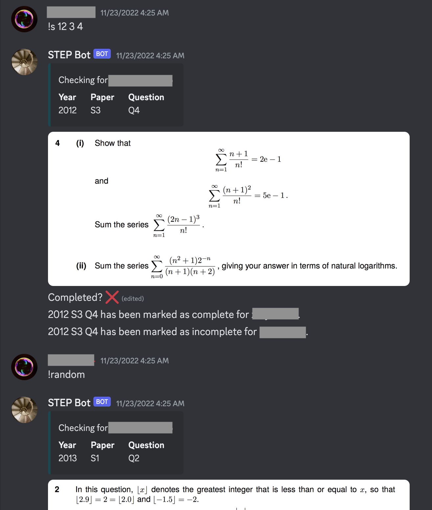

# STEP Discord Bot
A Discord Bot for the Cambridge Sixth Term Examination Paper (STEP)

Created with Python using PostgreSQL (psycopg2)

Emojis will become dysfunctional 60 minutes after the message is sent. This is necessary to make sure the bot is not overwhelmed with data

## Available Commands
* `!s` to retrieve a question e.g. `!s 99 2 3` to get 1999 STEP 2 Q3. You can then mark the question as complete/incomplete by reacting appropriately.
* `!c` to mark a question as complete eg `!c 99 2 3`
* `!uc` to mark a question as incomplete eg `!uc 99 2 3`
* `!show` to view the list of questions you have completed

The bot will accept the following input:
* `1999 S2 Q4`
* `99 2 4`, i.e. 1999 S2 Q4
* `3/3/4`, i.e. 2003 S3 Q4
* `09-S2-Q4`, i.e. 2009 S2 Q4

.